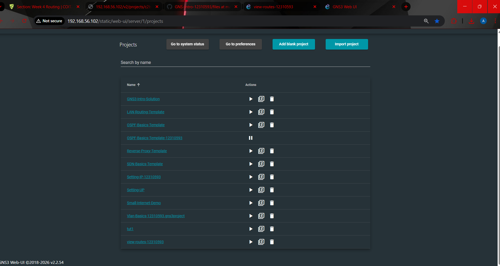

# GNS-Intro-12310593

This repository contains my GNS3 lab work and networking practice tasks.  
It includes exported **GNS3 project files**, supporting **screenshots**, and markdown documentation for the completed lab activities.  
The repository is organized to keep all project evidence, images, and files in one place for easy access and review.

---

## Repository Structure

The repository is organized into the following main folders and files:

- **images/**  
  Contains screenshots used as proof of topology creation, configuration, routing, ping results, VLAN work, ARP observations, and Netcat communication.

- **files/**  
  Contains exported **`.gns3project`** files for completed lab activities.

- **week01.md**  
  Documentation for Week 01 lab work.

- **week02.md**  
  Documentation for Week 02 lab work.

- **week03.md**  
  Documentation for Week 03 lab work.

- **week04.md**  
  Documentation for Week 04 lab work.

- **week05.md**  
  Documentation for Week 05 lab work.

- **week06.md**  
  Documentation for Week 06 lab work.

---

## GNS3 Project Evidence

The following screenshot shows my GNS3 Web UI project list as proof of the created and imported project work:

This confirms that multiple projects were created and used in GNS3, including:
- `Seting-IP-12310593`
- `Setting-UP`
- `view-routes-12310593`
- `OSPF-Basics-Template-12310593`
- `Vlan-Basics-12310593.gns3project`

---

## Exported Project Files

The **files/** folder contains the exported GNS3 project files used as submission evidence.

Examples include:
- `GNS3-Intro-week01.gns3project`
- `Setting-IP-12310593.gns3project`
- `Setting-UP.gns3project`
- `Vlan-Basics-12310593.gns3project.gns3project`

These files represent the saved lab projects completed during the practical tasks.

---

## Documentation Files

The repository also includes markdown documentation files for the weekly lab work:

- [Week 01](week01.md)
- [Week 02](week02.md)
- [Week 03](week03.md)
- [Week 04](week04.md)
- [Week 05](week05.md)
- [Week 06](week06.md)

Each file contains screenshots, configuration details, task descriptions, and reflections related to the corresponding week.

---

## Notes

- All screenshots used as proof are stored in the **images/** folder.
- All exported GNS3 project files are stored in the **files/** folder.
- This repository is intended to present both the practical networking tasks and the supporting evidence in an organized format.
