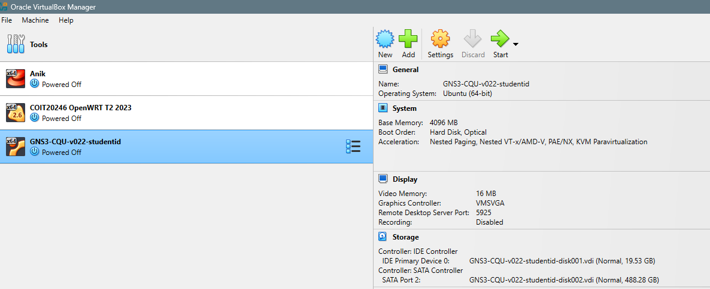
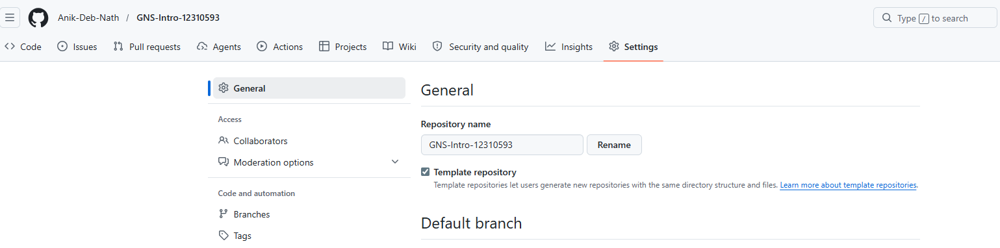
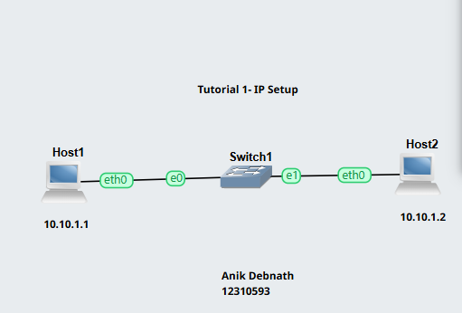
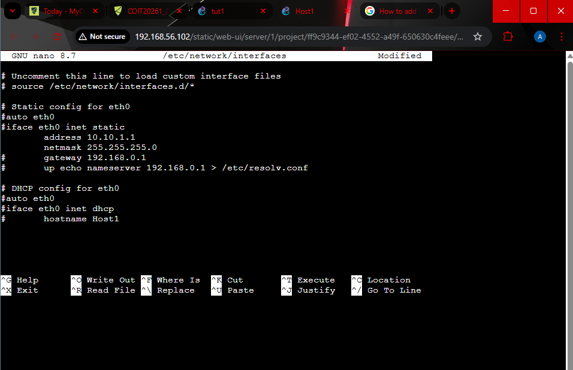
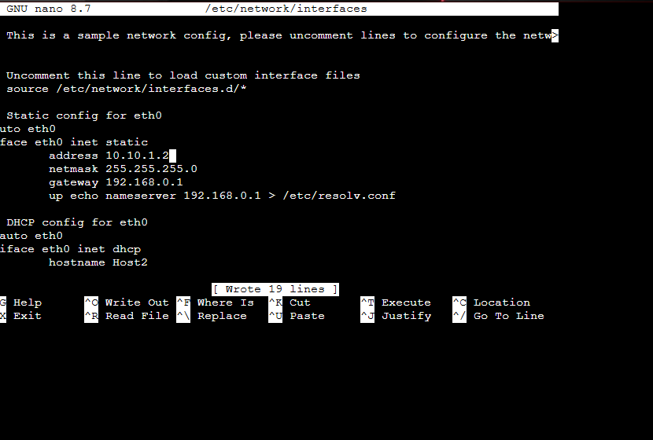
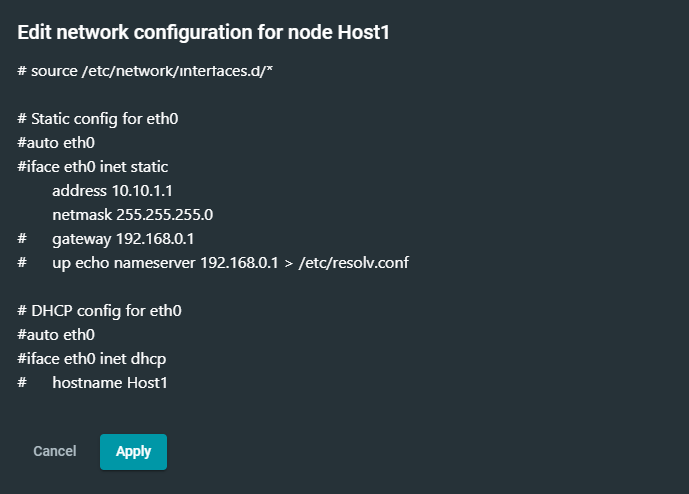
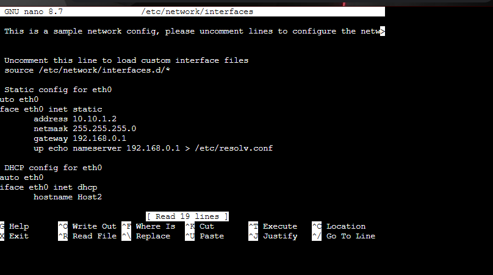

# Week 01 Lab Work Documentation

This document presents the screenshots and brief explanations of the tasks completed in Week 01.  
The work includes setting up the GNS3 environment, renaming the GitHub repository, adding the network diagram, assigning static IP addresses to both hosts, and checking the IP configuration results.

---

## 1. GNS3 Setup

This screenshot shows the initial VirtualBox setup used for the GNS3 lab environment.  
The virtual machine named **GNS3-CCU-v022-studentid** is prepared before starting the lab work.  
This step is important because the GNS3 environment depends on the virtual machine to run the network simulation properly.

---

## 2. Repository Rename

This screenshot shows the GitHub repository settings page after renaming the repository to **GNS-Intro-12310593**.  
Renaming the repository helps keep the submission organized and makes it easy to identify according to the student ID.

---

## 3. Network Diagram

This screenshot shows the network topology or diagram used in this lab task.  
It represents the connection structure between the devices used in GNS3.  
The diagram provides a clear overview of how the hosts are arranged and helps in understanding the IP addressing and connectivity configuration.

---

## 4. Static IP Assignment for Host1

This screenshot shows the configuration of **Host1** inside the `/etc/network/interfaces` file.  
A static IP address is assigned manually so that the host can use a fixed network configuration instead of receiving one automatically through DHCP.

The configuration used for Host1 is:
- **IP Address:** 10.10.1.1
- **Netmask:** 255.255.255.0
- **Gateway:** 192.168.0.1

This step is necessary to ensure that Host1 has a stable and predictable network address for communication in the topology.

---

## 5. Static IP Assignment for Host2

This screenshot shows the configuration of **Host2** inside the `/etc/network/interfaces` file.  
Like Host1, Host2 is also configured with a static IP address to maintain manual control over the network settings.

The configuration used for Host2 is:
- **IP Address:** 10.10.1.2
- **Netmask:** 255.255.255.0
- **Gateway:** 192.168.0.1

This ensures that both hosts remain in the same network and can be tested for connectivity.

---

## 6. IP Configuration Check for Host1

This screenshot shows the verification of the IP configuration on **Host1** after assigning the static IP address.  
The purpose of this check is to confirm that the network settings were applied correctly and that the interface is ready for communication.

This step is useful for identifying whether the configuration file was written correctly and whether the host received the expected IPv4 address.

---

## 7. IP Configuration Check for Host2

This screenshot shows the verification of the IP configuration on **Host2** after assigning the static IP address.  
This step is performed to check whether Host2 successfully received the configured IPv4 address and whether the network interface is active.

It is also useful for troubleshooting any configuration errors if the expected IP address does not appear correctly.

---

## Reflection

In this lab, I learned how to prepare the GNS3 environment, organize the GitHub repository, and configure static IP addresses manually for network hosts. I understood the importance of editing the `/etc/network/interfaces` file correctly, especially removing the comment symbols (`#`) from the required lines and providing valid IP address and netmask values. This task also helped me understand how hosts in the same network communicate using proper addressing.

While completing the work, I also faced some configuration issues, especially when the expected IPv4 address did not appear. From this, I learned that even a small mistake in the configuration file can prevent the network interface from being set properly. By checking the configuration again and verifying the results using IP checking commands, I was able to better understand the troubleshooting process. Overall, this lab improved my practical knowledge of basic network setup, IP addressing, and documentation of technical work using GitHub.
