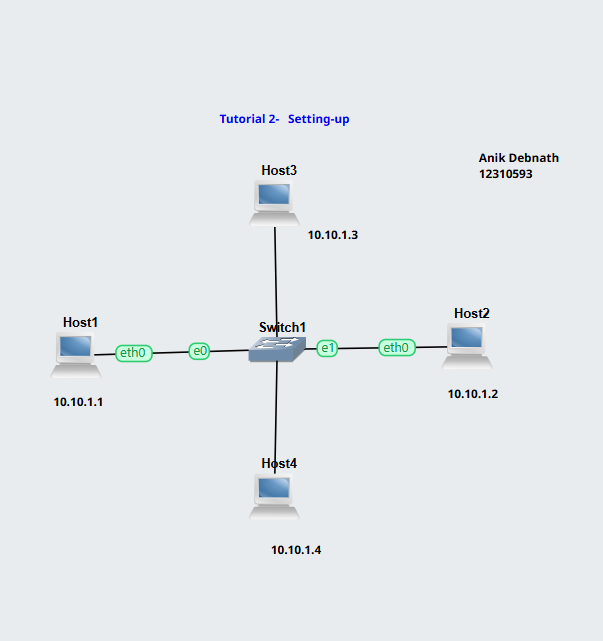
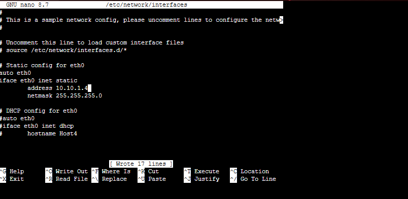
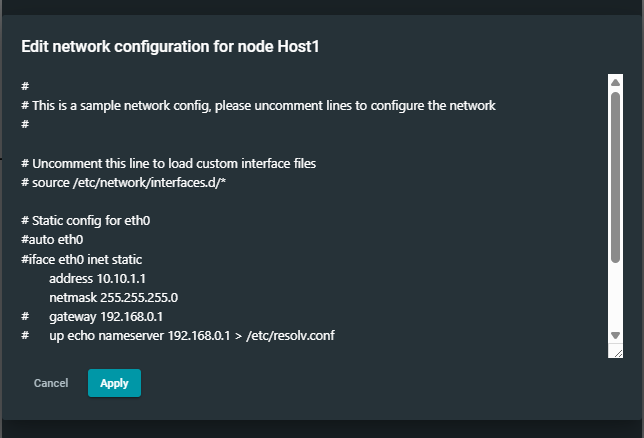
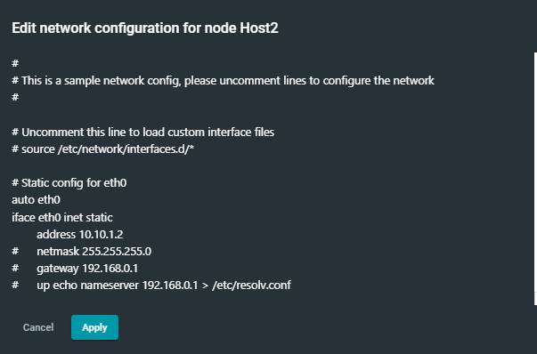
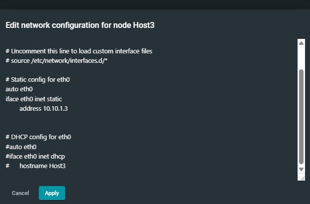
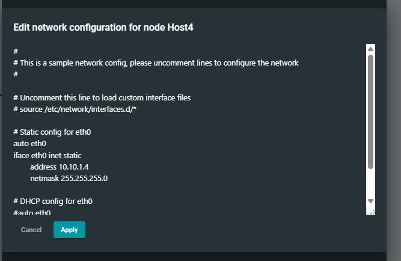
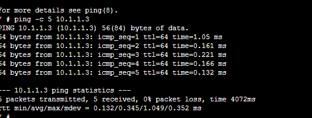
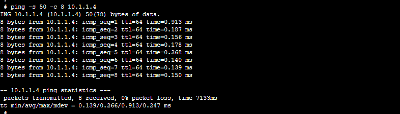
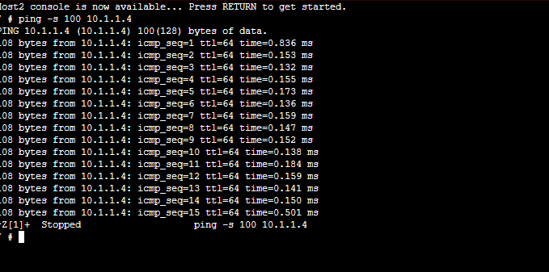

# Week 02 Lab Work Documentation

This document presents the screenshots and explanations of the tasks completed in Week 02.  
In this lab, a network topology was created using one switch and four hosts. Static IP addresses were assigned to each host, and then connectivity was tested using different `ping` commands. The purpose of this lab was to understand basic network setup, manual IP configuration, and communication testing between hosts in the same subnet.

---

## 1. Network Topology

This screenshot shows the network topology created for Week 02.  
The topology contains one switch and four hosts: **Host1, Host2, Host3, and Host4**. Each host is connected to the switch through interface **eth0**. All hosts are configured in the same subnet so that they can communicate directly with each other.

The IP addressing plan used in this topology is:
- **Host1:** 10.10.1.1
- **Host2:** 10.10.1.2
- **Host3:** 10.10.1.3
- **Host4:** 10.10.1.4

This topology provides a simple local area network for testing host-to-host communication.

---

## 2. General IP Assignment Syntax

This screenshot shows the general static IP assignment pattern used in this lab.  
When configuring `/etc/network/interfaces`, the IP address must be set for the first interface, which is **eth0**. The file includes example lines, but they are commented out with the `#` symbol. To activate the static IP configuration, the hash symbols must be removed from the required lines and the necessary values must be edited.

The general syntax is:  
auto eth0  
iface eth0 inet static  
address `<ipaddress>`  
netmask `<networkmask>`

This same syntax was followed for all four hosts in Week 02.

---

## 3. Static IP Assignment for Host1

This screenshot shows the static IP configuration of **Host1** in the `/etc/network/interfaces` file.  
Host1 was configured manually by enabling the static configuration lines and entering the correct network values.

The configuration used for Host1 is:
- **IP Address:** 10.10.1.1
- **Netmask:** 255.255.255.0

This ensures that Host1 can communicate with the other hosts in the same network.

---

## 4. Static IP Assignment for Host2

This screenshot shows the static IP configuration of **Host2**.  
The `eth0` interface was configured manually with a fixed IPv4 address and subnet mask.

The configuration used for Host2 is:
- **IP Address:** 10.10.1.2
- **Netmask:** 255.255.255.0

This allows Host2 to communicate properly with the rest of the hosts in the topology.

---

## 5. Static IP Assignment for Host3

This screenshot shows the static IP configuration of **Host3**.  
The same static configuration method was applied to Host3 by editing the `/etc/network/interfaces` file.

The configuration used for Host3 is:
- **IP Address:** 10.10.1.3

This step expands the network and allows testing of communication between multiple hosts.

---

## 6. Static IP Assignment for Host4

This screenshot shows the static IP configuration of **Host4**.  
The network settings for the `eth0` interface were edited manually in order to assign a fixed IP address.

The configuration used for Host4 is:
- **IP Address:** 10.10.1.4
- **Netmask:** 255.255.255.0

This completed the IP addressing process for all four hosts in the topology.

---

## 7. Connectivity Test Using Ping Count

This screenshot shows a connectivity test using the `ping` command with a fixed packet count.  
A specific number of ICMP echo requests were sent from one host to another in order to verify connectivity.

The result shows:
- Packets were transmitted successfully
- Replies were received from the destination host
- There was **0% packet loss**

This confirms that the hosts were able to communicate successfully after the static IP configuration.

---

## 8. Connectivity Test Using Combined Ping Options

This screenshot shows another connectivity test using combined `ping` options.  
This test is useful for checking repeated communication and ensuring that the destination host responds properly to all requests.

The successful output indicates that the network communication remained stable during the test.

---

## 9. Connectivity Test Using Different Packet Size

This screenshot shows a ping test using a different packet size.  
Changing the packet size helps observe how the network handles different ICMP packet lengths during communication.

The result shows successful replies without packet loss, which confirms that the network is functioning properly even with modified packet sizes.

---

## Reflection

In this lab, I learned how to create a small network topology using one switch and four hosts in GNS3. I also learned how to assign static IP addresses manually by editing the `/etc/network/interfaces` file. This helped me understand how proper IP addressing allows multiple devices in the same subnet to communicate with each other.

Another important part of this lab was testing connectivity with different `ping` commands. By using packet count and packet size options, I was able to observe how hosts respond under different test conditions. This improved my understanding of basic network testing and troubleshooting. Overall, this lab gave me practical experience in topology setup, static IP configuration, and communication testing in a simulated networking environment.

The GNS3 project file used for this lab is attached below. This file contains the saved network topology and configuration setup for Week 02.

[Setting-UP.gns3project](files/Setting-UP.gns3project)
