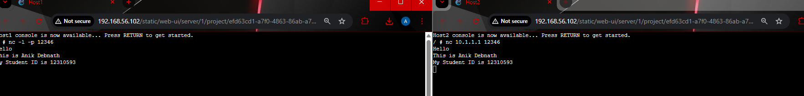

# Week 03 Lab Work Documentation

This section presents the basic Netcat client-server communication test completed in Week 03. In this task, Netcat was used to establish a simple connection between two hosts so that text messages could be exchanged. This activity helped demonstrate application-level communication between devices and showed how Netcat differs from both `ping` and the commands `nc` and `netcat`.

---

## 1. Netcat Client-Server Communication

This screenshot shows a simple Netcat communication test between **Host1** and **Host2**.  
One host was configured in **server mode**, while the other host was configured in **client mode**. After the connection was established, text messages were exchanged between the two devices.

In the screenshot, both hosts display the following messages:
- `Hello`
- `This is Anik Debnath`
- `My Student ID is 12310593`

This confirms that the client and server were able to communicate successfully using Netcat.

---

## 2. Netcat vs nc

`Netcat` is the name of the software, while `nc` is the command commonly used to run it.  
Some operating systems use the command `netcat`, some use `nc`, and some support both. In most cases, they are functionally the same, although the supported options may vary slightly depending on the installed version.

| Term | Meaning | Notes |
|------|---------|-------|
| **Netcat** | Name of the software/tool | Refers to the actual networking utility |
| **nc** | Common command used to run Netcat | Shorter and more widely used in examples |
| **netcat** | Alternative command name on some systems | Often behaves the same as `nc` |

### Description
Although the software is called **Netcat**, the command most often used in examples is **`nc`** because it is shorter and more common in online tutorials and documentation. If instructions mention `netcat`, it usually means the same tool as `nc`.

---

## 3. Netcat vs Ping

Netcat and Ping are both useful for testing communication between two devices, but they work at different layers and serve different purposes.

| Feature | Netcat | Ping |
|---------|--------|------|
| **Communication Type** | Application-level | Network-level |
| **Protocol Used** | TCP or UDP | ICMP |
| **Purpose** | Send and receive messages between devices | Check whether a device is reachable |
| **Interaction** | Can exchange custom text/data | Only tests connectivity and response time |
| **Usage** | Client-server communication testing | Basic reachability testing |

### Description
**Netcat** is a simple client-server application that allows two devices to exchange text or data over **TCP** or **UDP**. It is useful for testing whether communication works at the application level.  
**Ping**, on the other hand, uses **ICMP** to check whether a destination device is reachable on the network. It does not send user messages like Netcat.

It is good practice to test communication using both **Ping** and **Netcat**, because sometimes one may work while the other does not. For example, a device may reply to Ping but fail to accept application-level connections.

---

## 4. Using Netcat

To use Netcat, one host must be started in **server mode**, and another host must connect in **client mode**.

### Server command
On the host acting as the server, Netcat listens on port **12346**:

`nc -l -p 12346`

### Client command
On the client host, connect using the server IP address and port:

`nc 10.1.1.1 12346`

After the connection is established, both the client and the server can exchange text messages by typing and pressing **ENTER**.

### Description
In this lab, **Host1** was used as the server and listened on port **12346**. **Host2** was used as the client and connected to **10.1.1.1** on port **12346**. After the connection was established, both devices exchanged text messages successfully. This confirmed that the communication worked properly at the application level.

---

## Reflection

In this lab, I learned how to use Netcat as a simple client-server communication tool. I understood that one host must first listen on a specific port as the server, while the other host connects as the client. After the connection is established, both hosts can exchange messages directly. This helped me understand how application-level communication works between devices.

I also learned the difference between Netcat, `nc`, and Ping. Netcat is the software, while `nc` is the commonly used command to run it. Ping only checks network reachability using ICMP, but Netcat can test real message exchange using TCP or UDP. This made it clear that both tools are important for communication testing, but they serve different purposes.
