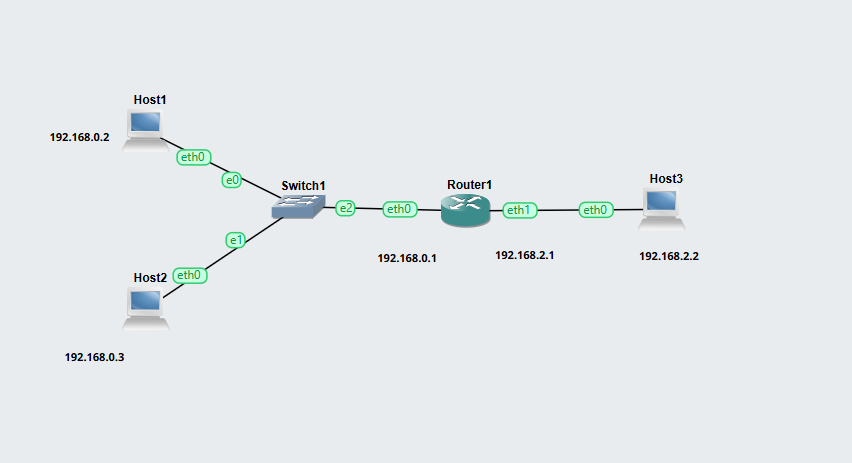
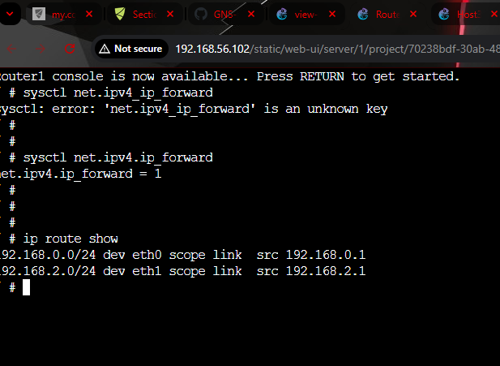
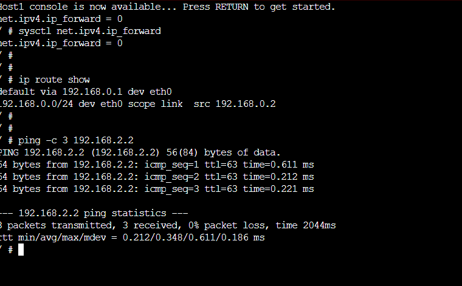
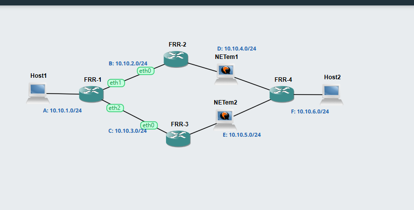
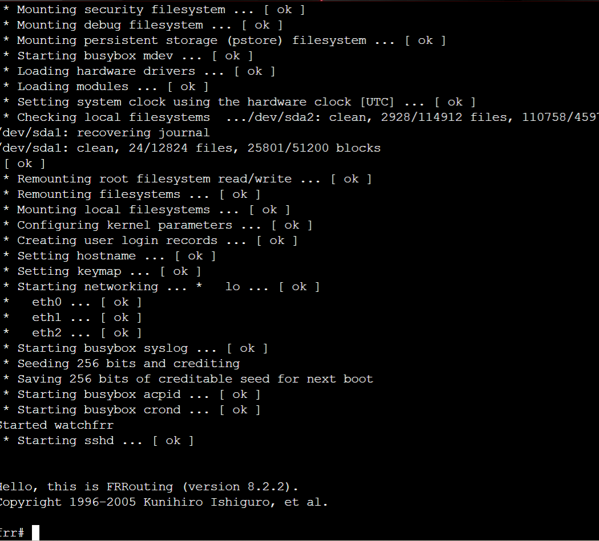
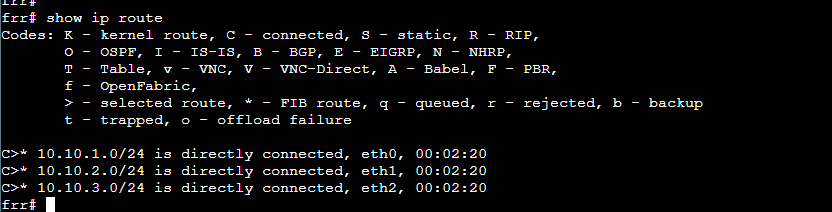
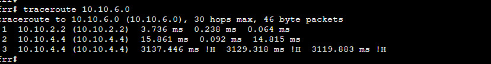

# Week 04 Lab Work Documentation

This document presents the tasks completed in Week 04. In this week, two separate networking activities were performed. The first task focused on viewing routing tables and testing communication between different subnets using a router. The second task focused on observing dynamic routing with OSPF using FRRouting (FRR) routers. These activities helped build understanding of routing, forwarding, and path selection in a network.

---

# Task 1: View Routing Tables

## 1. Network Topology

This screenshot shows the network used for the routing table activity.  
The topology contains **three hosts**, **one router**, and **one switch**, creating **two subnets**.  
**Host1** and **Host2** are connected to **Switch1**, which is then connected to **Router1**. **Host3** is connected directly to **Router1**.

The addressing structure used in the topology is:
- **Host1:** 192.168.0.2
- **Host2:** 192.168.0.3
- **Router1 eth0:** 192.168.0.1
- **Router1 eth1:** 192.168.2.1
- **Host3:** 192.168.2.2

This topology allows communication between two different subnets through the router.

---

## 2. Forwarding and Routing Table Verification

This screenshot shows the verification of **IP forwarding** and the **routing table**.  
Forwarding was enabled on the router so that packets could be transferred between the two subnets. The routing table output confirms that Router1 has directly connected routes for both networks:
- **192.168.0.0/24** through `eth0`
- **192.168.2.0/24** through `eth1`

This confirms that the router is correctly configured to forward traffic between the two networks.

---

## 3. Successful Ping Across Subnets

This screenshot shows a successful ping test from **Host1** to **Host3**.  
The ping result confirms that communication between the two subnets was successful through **Router1**.  
The response also shows that:
- Packets were transmitted successfully
- Replies were received from the destination host
- There was **0% packet loss**

This proves that the host IP addresses, gateway settings, and router forwarding configuration were correctly applied.

---

## Reflection on Task 1

In this task, I learned how to configure a router to connect two different subnets and how to verify the routing process using routing table commands. I also learned the importance of enabling IP forwarding on the router and setting the correct default gateway on hosts. The successful ping between Host1 and Host3 showed that the router was correctly forwarding packets between the two networks. This task improved my understanding of basic routing and subnet communication.

---

# Task 2: Dynamic Routing with OSPF

## 4. OSPF Network Topology

This screenshot shows the OSPF-based network topology used in the second task.  
The topology contains:
- **Two hosts**
- **Four FRR routers**
- **Two NETem nodes**

The routers are connected in a way that creates **multiple paths** between Host1 and Host2. This setup is useful for observing how OSPF dynamically selects routes and adapts when one path becomes unavailable.

The network labels shown in the diagram include:
- **A:** 10.10.1.0/24
- **B:** 10.10.2.0/24
- **C:** 10.10.3.0/24
- **D:** 10.10.4.0/24
- **E:** 10.10.5.0/24
- **F:** 10.10.6.0/24

This topology demonstrates dynamic routing behavior in a multi-router network.

---

## 5. FRRouting Startup and OSPF Environment

This screenshot shows the FRRouting router console after booting successfully.  
The prompt confirms that the FRR router is running and ready to accept routing-related commands.  
At this stage, the routers can be used to observe:
- OSPF neighbor relationships
- OSPF learned routes
- Linux routing table entries

This verifies that the dynamic routing environment is active and ready for testing.

---

## 6. OSPF Routing Table Output

This screenshot shows the output of the `show ip route` command on one of the FRR routers.  
The output lists the currently known routes and identifies which networks are directly connected. In this case, the router shows direct connections to:
- **10.10.1.0/24** through `eth0`
- **10.10.2.0/24** through `eth1`
- **10.10.3.0/24** through `eth2`

This routing table is important because it helps identify how the router understands the network and which interfaces are connected to which destination subnets.

---

## 7. Traceroute Observation in OSPF Network

This screenshot shows the result of a `traceroute` command in the OSPF network.  
The output is used to observe the path taken from one device to another destination subnet. In the traceroute result, intermediate router IP addresses are shown hop by hop, helping identify the route currently selected by OSPF.

This is useful because:
- it shows the actual forwarding path
- it helps verify which routers are being used
- it can be compared before and after disconnecting a link

The output also indicates that some probes did not complete successfully, which can happen during path changes, temporary unreachability, or when the destination entered in traceroute is not a host address.

---

## Reflection on Task 2

In this task, I learned how OSPF works as a dynamic routing protocol in a network with multiple routers. Unlike static routing, OSPF automatically learns routes and can adjust to network changes. The topology showed how multiple paths can exist between two hosts, and FRR helped simulate this behavior in GNS3. By checking the routing table and traceroute output, I gained a clearer understanding of how routers choose paths and how traffic flows through different intermediate devices. This task improved my understanding of neighbor discovery, route learning, and dynamic path selection in a routed network.

---

# Overall Reflection

Week 04 gave me practical experience with both **static routing concepts** and **dynamic routing concepts**. In the first task, I worked with a router and hosts to understand routing tables, forwarding, and inter-subnet communication. In the second task, I explored OSPF and saw how routers can automatically maintain routing information in a larger network. Together, these tasks helped me build a stronger foundation in routing, network communication, and troubleshooting.
