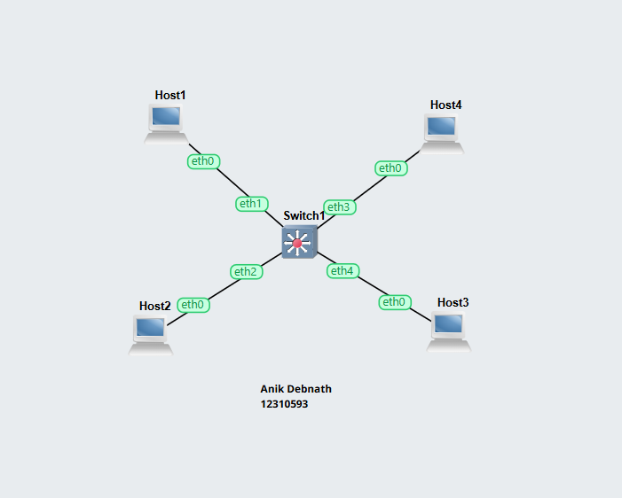
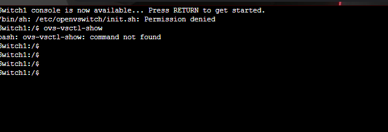

# Week 05 Lab Work Documentation

This document presents the tasks completed in Week 05. In this week, the focus was on **VLAN basics**. The activity helped demonstrate how VLANs can be used to logically divide devices in a network, even when they are connected to the same switch. It also showed the effect of incorrect or incomplete VLAN configuration and how communication is affected when hosts are placed in different VLANs.

---

# Task: VLAN Basics

## 1. VLAN Network Topology

This screenshot shows the network topology used for the VLAN activity.  
The topology contains:
- **Four hosts**
- **One switch**

All four hosts are connected to **Switch1**, but the purpose of this lab is to logically separate them using VLAN configuration instead of physical separation.

This type of setup is useful because VLANs allow a single switch to create multiple isolated broadcast domains. As a result, devices can be grouped according to network requirements without needing separate physical switches.

---

## 2. VLAN Configuration Problem / Observation

This screenshot shows the issue or problem observed during the VLAN activity.  
The purpose of this part of the lab was to identify how communication changes when VLAN settings are not configured correctly or when ports are assigned to different VLANs.

In a VLAN-based network:
- hosts in the **same VLAN** can normally communicate with each other
- hosts in **different VLANs** cannot communicate directly through a Layer 2 switch
- communication between different VLANs requires a **router** or **Layer 3 device**

This observation helps explain why some hosts may fail to communicate even though they are physically connected to the same switch.

---

## 3. VLAN Concept Summary

A **VLAN (Virtual Local Area Network)** is a logical grouping of devices within a network.  
Instead of depending only on physical connections, VLANs allow network administrators to divide devices into separate groups at the switch level.

### Main points of VLANs:
- VLANs improve network organization
- VLANs reduce unnecessary broadcast traffic
- VLANs improve security by isolating groups of hosts
- Devices in different VLANs cannot communicate directly without routing

In this lab, the VLAN setup demonstrated that logical separation is just as important as physical connection in determining whether hosts can exchange data.

---

## Reflection

In this lab, I learned the basic idea of VLANs and how they can be used to divide a single switched network into multiple logical networks. Even though all hosts were connected to the same switch, communication still depended on VLAN membership. This helped me understand that physical connection alone does not guarantee communication between devices.

I also learned that configuration mistakes in VLAN settings can easily cause communication problems. By observing the issue in the lab, I understood why hosts in different VLANs cannot communicate directly through a normal switch. Overall, this lab improved my understanding of VLAN segmentation, network isolation, and the importance of correct switch configuration.
