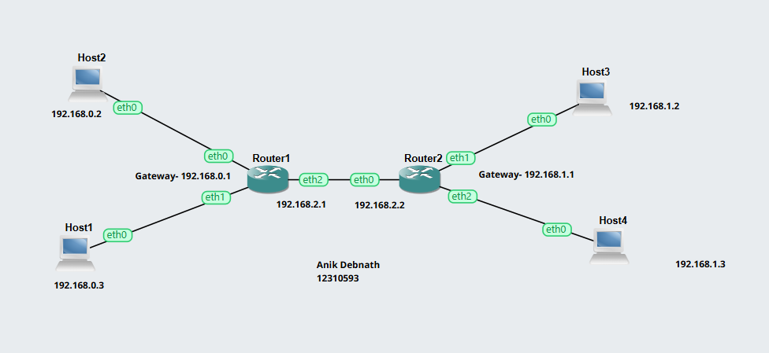
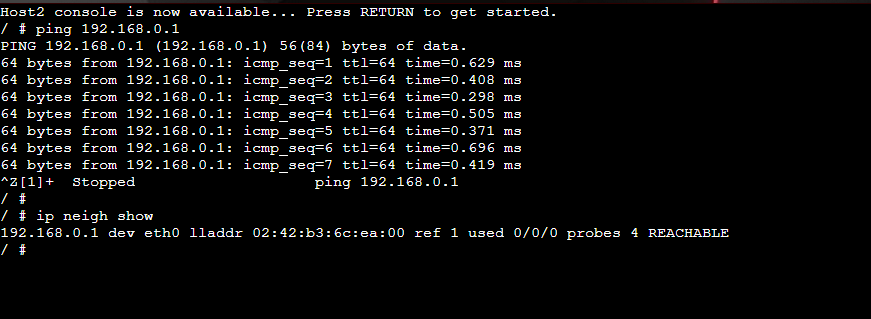
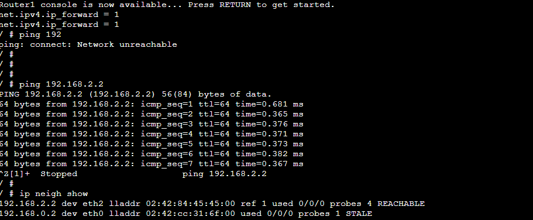

# Week 06 Lab Work Documentation

This document presents the tasks completed in Week 06. In this week, the focus was on **ARP basics**. The activity helped demonstrate how devices in a local network discover the MAC address of another device before sending frames. By observing the ARP table before and after communication, this lab showed how IP-to-MAC address mapping works in practice.

---

# Task: ARP Basics

## 1. ARP Network Topology

This screenshot shows the network topology used for the ARP activity.  
The topology contains multiple hosts connected in the same local network. This setup allows devices to communicate directly and makes it possible to observe how ARP is used before actual data transfer happens.

ARP is important in a local area network because a host may know the destination IP address, but it still needs the destination MAC address to send an Ethernet frame. That is why ARP is used as a bridge between Layer 3 addressing and Layer 2 addressing.

---

## 2. ARP Table Observation

This screenshot shows the ARP table observed during the lab.  
The ARP table stores mappings between **IP addresses** and **MAC addresses**. When a device wants to send data to another device in the same network, it first checks its ARP table. If no matching entry is found, it sends an ARP request to discover the correct MAC address.

The ARP table helps reduce repeated broadcasts because once the mapping is learned, the device can use the cached entry for future communication.

---

## 3. Updated ARP Table / Communication Result

This screenshot shows the updated ARP-related output after communication took place.  
After a ping or another communication test, the ARP table is updated with the learned MAC address of the destination device. This confirms that ARP successfully resolved the destination IP address into the corresponding hardware address.

This step is important because it shows ARP in action rather than only as a concept. It demonstrates how a device first learns the MAC address and then uses it for successful data transfer across the local network.

---

## ARP Concept Summary

**ARP (Address Resolution Protocol)** is used in IPv4 networks to map an IP address to a MAC address.  
When a host wants to communicate with another host on the same local network, it cannot send the Ethernet frame using only the IP address. It must first know the MAC address of the destination device.

### Main points of ARP:
- ARP is used in local area networks
- It maps an IPv4 address to a MAC address
- It uses broadcast requests and unicast replies
- ARP entries are stored temporarily in the ARP table
- Successful communication in a LAN often depends on ARP working correctly

This lab demonstrated that ARP is a fundamental part of local network communication and is required before many normal data exchanges can happen.

---

## Reflection

In this lab, I learned how ARP works in a practical networking environment. I understood that even when a device knows the destination IP address, it still needs the MAC address before it can send frames through the local network. Observing the ARP table helped me connect the theoretical concept with actual device behavior.

I also learned how ARP entries change after communication begins. By comparing the ARP information before and after sending traffic, I could clearly see how the system learns and stores IP-to-MAC mappings. Overall, this lab improved my understanding of local network communication, address resolution, and the relationship between IP addresses and hardware addresses.
